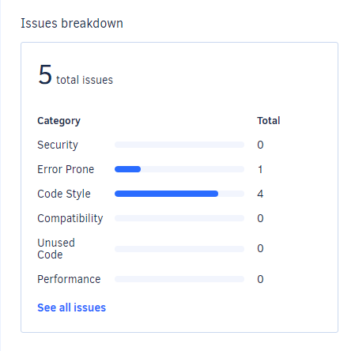

# Felhasználó Fókusz: Nem funkciónális jellemzők vizsgálata

## Teljesítmény

A programhoz készült példa csv fálj mindössze 4 rekordot tartalmaz, ezért ahhoz, hogy érdemi teljesítmény tesztelést tudjunk végezni, az első feladat az volt, hogy létrehozzunk egy olyan programot, ami tetszőleges méretű bemeneti csv fáljt tud generálni. Ezt egy egyszerű java programmal oldottuk meg, ami az nft_inputgenerator mappában található.

Az erőforráshasználat megfigyelésére az ej-technologies JProfiler programot használtam.
Két általunk generált csv fájlal teszteltünk: egy 500,000 sorossal és egy 1,000,000 sorossal.
A tesztekhez továbbra is az autós példa ttl fájlját használtuk.
Az erőforráshasználat az 500,000 soros fáljra:  

 
 
 Futási idő: 21.2s  
 Legmagasabb memória használat: 310.2 MB
 
 
 Az erőforráshasználat az 1,000,000 soros fáljra:  

 
 
 Futási idő: 39.2s  
 Legmagasabb memória használat: 311.8 MB
 
Megfigyelések:  
  - A program jól skálázható, a futási idő a bemenet méretének körülbelül lineáris függvénye. (O(n))
  - A memóriahasználat kis mértékben függ a bemenet méretétől.
  - A CPU használat a JVM indulásakor felugrik, majd beáll 6.25%-ra. Ez azért van, mert a tesztkörnyezetben 16 szál volt elérhető, és a program 1 szálon fut, az a szál viszont 100%-ra van terhelve. Amennyiben cél a futásidő csökkentése, érdemes lehet párhuzamosítással próbálkozni.
  
  ## Biztonság
  
  A biztonság tesztelésére Static Application Security Testing (SAST) eszközöket próbáltam keresni. A következőket találtam:
   - Insider CLI: Open source, a lefordított exe-t a windows vírusnak jelzi. Egy VM-ben windows defender kikapcsolása után elindítottam. Egyből bezárult, nem csinált semmit.
   - PT Application Inspector: Az ingyenes demó is csak komoly cégek számára elérhető.
   - Synopsis Coverity: Az ingyenes demó is csak komoly cégek számára elérhető.
   - MicroFocus Fortify: Ingyenes trial van, de nem egy teljesen automatikus ellenörző eszköz, 1 munkanapot kell várni az eredményre.
   - Reshift: az általunk használt build keretrendszert nem támogatja.
   
  Más alternatíva hiányában végül a Codacy statikus kódanalízis eszköz mellett döntöttem. Ez egy a SonarQube-hoz hasonló eszköz, nem csak kizárólag szoftverbiztonság javítására készült, de a top 10 OWASP sebezhetőséget felismeri. Ahhoz, hogy ezt az eszközt hozzá tudjuk adni a github repositorynkhoz, publikussá kellett tennem azt.
  
  Codacy által végzett analízis eredménye:  
  
  
  Amint látható, Codacy egyetlen sebezhetőséget sem talált. Ez valamilyen szinten várható volt, hiszen a tesztelt program egy pár száz sor hosszú, egyszerű parancssoros program. 
